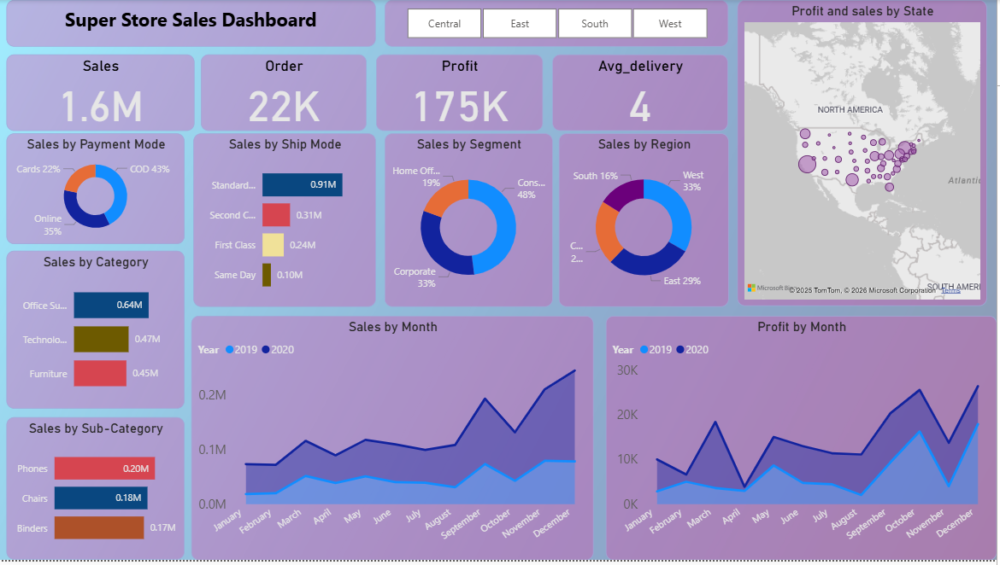

# 🛒 Super Store Sales Dashboard | Power BI

## Project Overview
This project analyzes Super Store sales data to uncover insights related to sales performance, profit trends, customer segments, shipping efficiency, and regional performance.  
The dashboard is developed using **Microsoft Power BI** and provides an interactive view for business decision-making.

---

## Project Objectives
- Analyze overall sales and profit performance
- Monitor total orders and delivery efficiency
- Identify top-performing regions and states
- Understand customer behavior by segment and payment mode
- Analyze category and sub-category performance
- Track monthly sales and profit trends

---

## Tools & Technologies
- **Power BI** – Dashboard design and visualization  
- **Power Query** – Data cleaning and transformation  
- **DAX** – KPIs and calculated measures  
- **Data Modeling** – Optimized relationships  

---

## 📂 Data Preparation
- Cleaned raw sales data
- Removed null and duplicate records
- Converted data types (date, numeric, currency)
- Renamed columns for clarity
- Created calculated measures for KPIs

---

## 📊 Key Analysis & Insights

### 1️⃣ Sales & Profit Overview
- Total Sales: **1.6M**
- Total Profit: **175K**
- Orders: **22K**
- Average Delivery Time: **4 days**

### 2️⃣ Payment Mode Analysis
- Online Payments
- Cash on Delivery (COD)
- Card Payments

### 3️⃣ Shipping Mode Analysis
- Standard Class
- Second Class
- First Class
- Same Day Delivery

### 4️⃣ Category & Sub-Category Analysis
- Categories: Furniture, Technology, Office Supplies
- Top Sub-Categories:
  - Phones
  - Chairs
  - Binders

### 5️⃣ Customer Segment Analysis
- Consumer
- Corporate
- Home Office

### 6️⃣ Regional & State-wise Analysis
- Regions: Central, East, South, West
- State-wise sales and profit using map visualization

### 7️⃣ Monthly Trend Analysis
- Month-wise sales and profit comparison
- Year-over-year performance analysis

---

## 📈 Key KPIs
- Total Sales
- Total Orders
- Total Profit
- Average Delivery Time

---

##  Dashboard Preview

---

## 📁 Project Files
- `SuperStore_sales_data.pbix` – Power BI dashboard file  
- `Dashboard.png` – Dashboard screenshot  
- `project_summary.txt` – Project documentation  

---

## Business Impact
- Helps identify profitable regions and products
- Improves logistics and shipping decisions
- Supports sales forecasting and planning
- Enhances customer and segment-level analysis

---

## Outcome
This project demonstrates hands-on expertise in:
- Data Cleaning & Transformation
- DAX Calculations
- Data Modeling
- Interactive Dashboard Design
- Business Intelligence & Analytics

This project is ideal for **Data Analyst, Business Analyst, and BI Developer** roles.

---

## 👤 Author
**Pradeep Sharma**  
  Aspiring Data Analyst  
